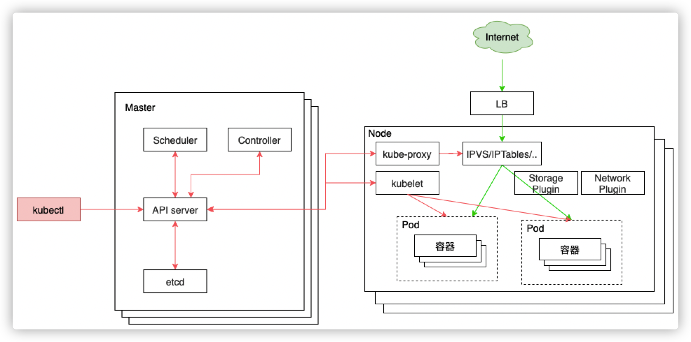
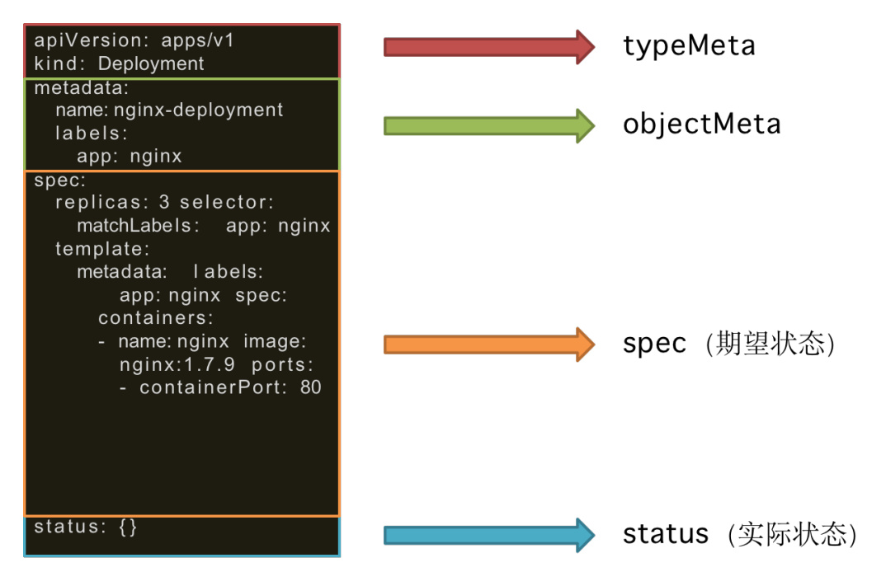

kubernetes，是基于容器技术实现的资源自动化管理平台（容器编排平台），具备调度、自愈、水平伸缩等功能。能够帮助节省30%的开发成本，将精力更加集中于业务本身，大幅降低了系统后期的运维难度和运维成本。

## kubernetes架构

## 核心概念

* pod

  最小调度单元，提供容器运行环境，定义容器执行方式

* Volume

  Pod可访问的文件目录；支持多种存储抽象

* Deployment

  管理Pod部署的副本、部署方案版本

* Service

  提供Pod对外访问地址

* Namespace

  集群内资源隔离的机制

Yaml文件格式：

