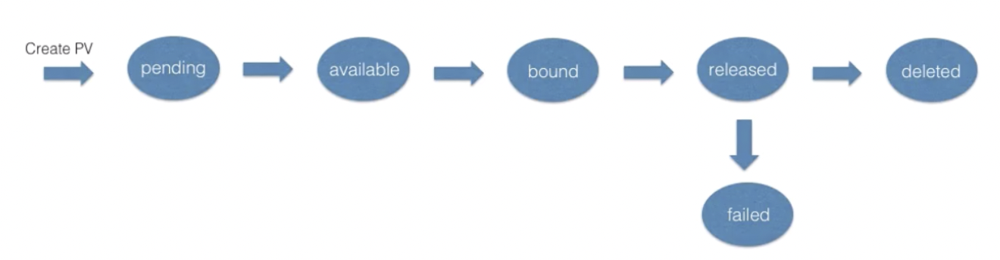

# 存储

## Volume(本地存储卷)

#### 以volume形式挂载到容器的对象包括：

* ConfigMap

* Secret

* Downward API：将pod获取容器的元数据信息以文件形式挂载到容器中

* Projected Volume：用于解决将多个资源挂载同一目录的问题

  ```yaml
  volumes：
  - name: all-in-one
    projected:
      sources:
      - secret:
        name: mysecret
        items:
          - key: username
            path: group/username
      - downwardAPI:
        items:
          - path: "labels"
          fieldRef:
            fieldPath: metadata.labels
      - configMap:
        name: mycm
        items:
          - key: config
            path: group/config
  ```

* ServiceAccountToken：serviceaccount的token数据

#### Volume类型

* emptyDir：由pause容器创建的临时空间，生命周期与pod相同；可以通过medium = Memory设置为使用内存
* hostPath：挂载宿主机上的文件和目录，可以用于持久化数据（风险是会随pod调度变换主机），可以用于访问宿主机的docker引擎、监控系统


## PV PVC StorageClass

PV是k8s中对存储资源抽象，是容器可以使用的资源。为了动态根据用户需求创建PV，系统管理员会先定义好创建PV的模版StorageClass，用户在使用时只需要引用对应的模版并写出所用存储的大小、读写权限等即可，这些信息记录在PVC中。存储插件控制器会根据StorageClass和PVC中其他信息自动创建。


### Storage Class

本质是自动化根据PVC创建PV并绑定，配置的参数包括：

* Provisioner存储提供者
* Reclaim Policy：资源回收策略，包括Delete（默认）和Retain
* Allow Volume Expansion：是否运行扩容，需要Volume底层支持该功能
* Volume Binding Mode：绑定模式，Immediate（默认）和WaitForFirstConsumer

### PV状态的流转

PV在创建开始后，处于pengding，直到创建完成状态变为available。当PVC和PV绑定后，状态变为bound。当绑定的PVC删除，则变为released。released后的PV无法进行再次和PVC绑定。




## Volume Plugins

PV、PVC这种存储管理机制，需要将存储管理的代码放到k8s代码库中，与k8s一起发布管理，是In-Tree模式，这种模式与k8s紧耦合。另外一种扩展k8s存储方式是基于CSI标准，代码独立存在的方式，称为Out-of-Tree。


## 存储快照

存储快照的设计其实是仿照 pvc & pv 体系的设计思想。当用户需要存储快照的功能时，可以通过 VolumeSnapshot 对象来声明，并指定相应的 VolumeSnapshotClass 对象，之后由集群中的相关组件动态生成存储快照以及存储快照对应的对象 VolumeSnapshotContent。

PVC 对象将其的 dataSource 字段指定为 VolumeSnapshot 对象，这样就可以恢复数据。


# 常用PV

## local storage

1. 创建本地PV

   ```yaml
   apiVersion: v1
   kind: PersistentVolume
   metadata:
     name: local-pv
   spec:
     capacity:
       storage: 5Gi
     volumeMode: Filesystem
     accessModes:
     - ReadWriteOnce
     persistentVolumeReclaimPolicy: Delete
     storageClassName: local-storage
     local:
       path: /data/k8s_pv/volume1
     nodeAffinity:
       required:
         nodeSelectorTerms:
         - matchExpressions:
           - key: kubernetes.io/hostname
             operator: In
             values:
             - efa-blpr600005
   ```

* 
