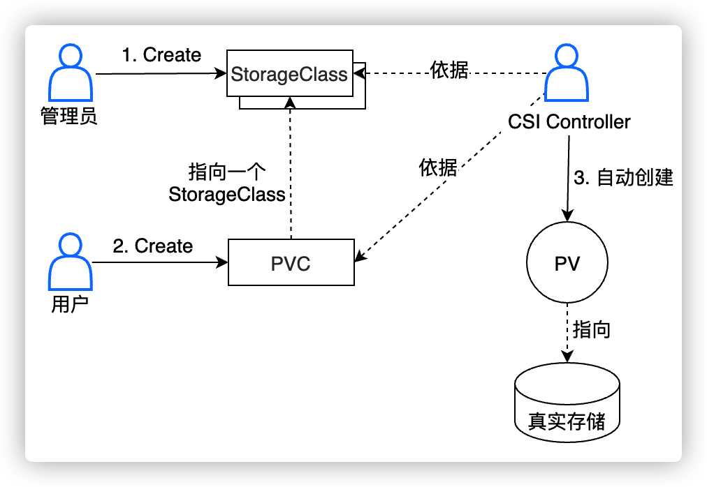

## Volume

Volume是pod中由pause容器创建，被pod中所有容器共享，生命周期与pod相同。

* emptyDir：临时空间
* hostPath：挂载宿主机上的文件和目录，可以用于持久化数据（会随pod调度变换主机），可以访问宿主机的docker引擎

## PV PVC StorageClass

k8s中存储是由PV表示的。为了动态根据用户需求创建PV，系统管理员会先定义好创建PV的模版StorageClass，用户在使用时只需要引用对应的模版并写出所用存储的大小、读写权限等即可，这些信息记录在PVC中。存储插件控制器会根据StorageClass和PVC中其他信息自动创建。



## PV状态的流转

PV在创建开始后，处于pengding，直到创建完成状态变为available。当PVC和PV绑定后，状态变为bound。当绑定的PVC删除，则变为released。released后的PV无法进行再次和PVC绑定。


## Volume Plugins

根据源码的位置分为In-Tree和Out-of-Tree两类，与k8s一起发布管理的是In-Tree。独立存在的，由存储实现的是Out-of-Tree，包括CSI/Flexvolume。

## 存储快照

存储快照的设计其实是仿照 pvc & pv 体系的设计思想。当用户需要存储快照的功能时，可以通过 VolumeSnapshot 对象来声明，并指定相应的 VolumeSnapshotClass 对象，之后由集群中的相关组件动态生成存储快照以及存储快照对应的对象 VolumeSnapshotContent。

PVC 对象将其的 dataSource 字段指定为 VolumeSnapshot 对象，这样就可以恢复数据。

# PV

## local storage

1. 创建本地PV

   ```yaml
   apiVersion: v1
   kind: PersistentVolume
   metadata:
     name: local-pv
   spec:
     capacity:
       storage: 5Gi
     volumeMode: Filesystem
     accessModes:
     - ReadWriteOnce
     persistentVolumeReclaimPolicy: Delete
     storageClassName: local-storage
     local:
       path: /data/k8s_pv/volume1
     nodeAffinity:
       required:
         nodeSelectorTerms:
         - matchExpressions:
           - key: kubernetes.io/hostname
             operator: In
             values:
             - efa-blpr600005
   ```


# Storage Class

本质是自动化根据PVC创建PV并绑定，配置的参数包括：

* Provisioner存储提供者
* Reclaim Policy：资源回收策略，包括Delete（默认）和Retain
* Allow Volume Expansion：是否运行扩容，需要Volume底层支持该功能
* Volume Binding Mode：绑定模式，Immediate（默认）和WaitForFirstConsumer
