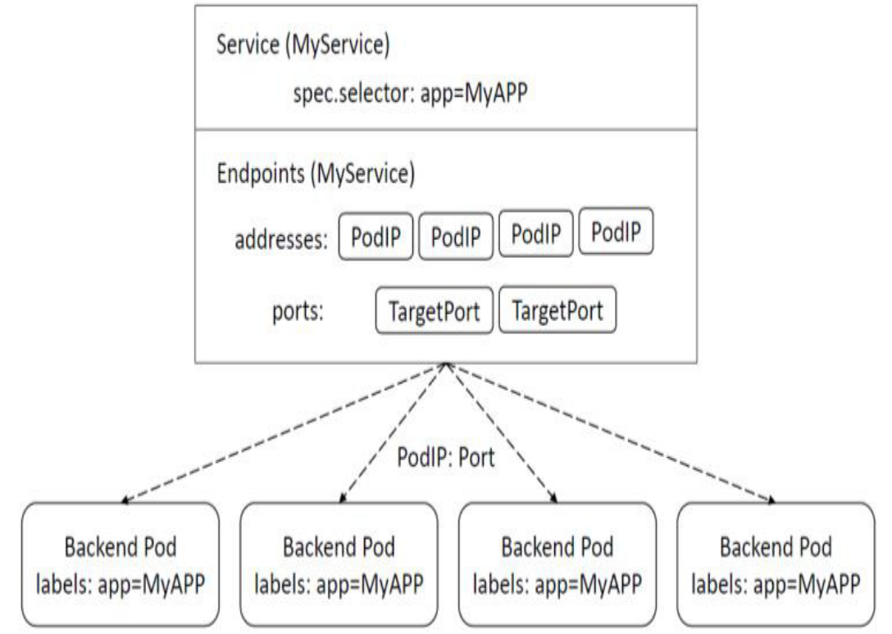
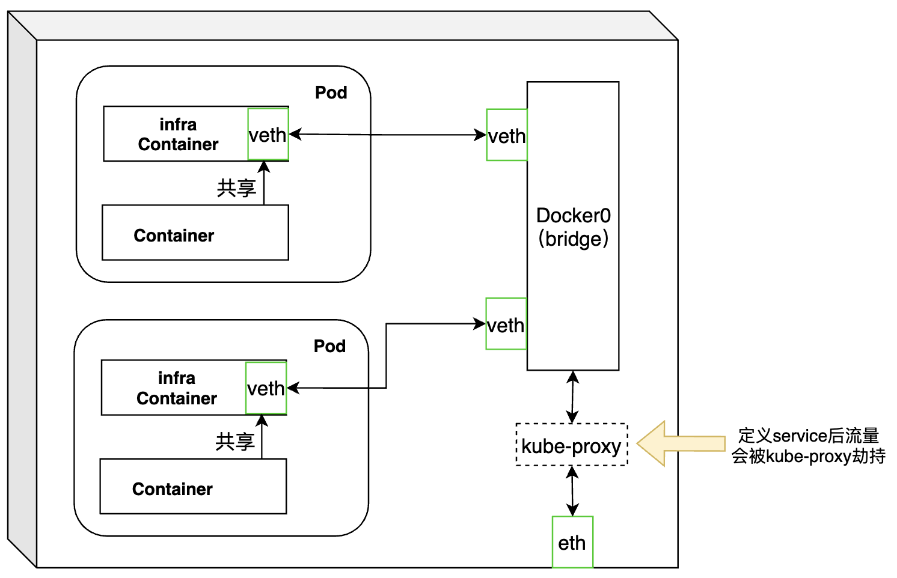
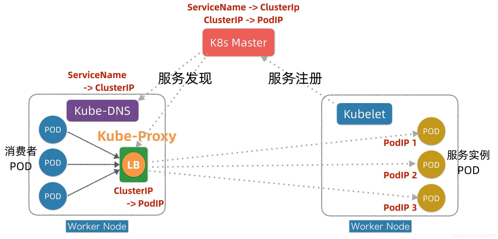
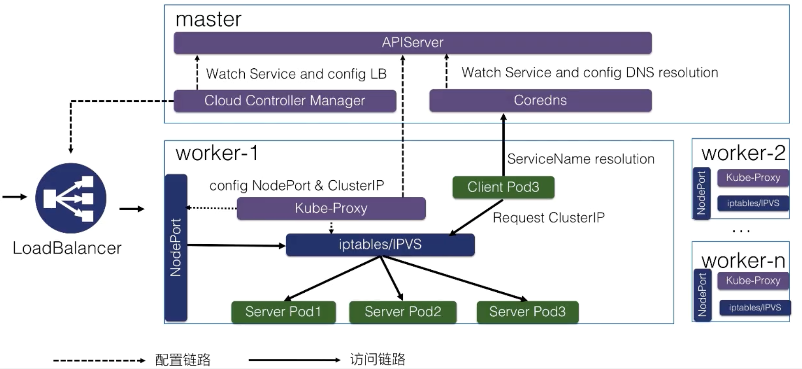
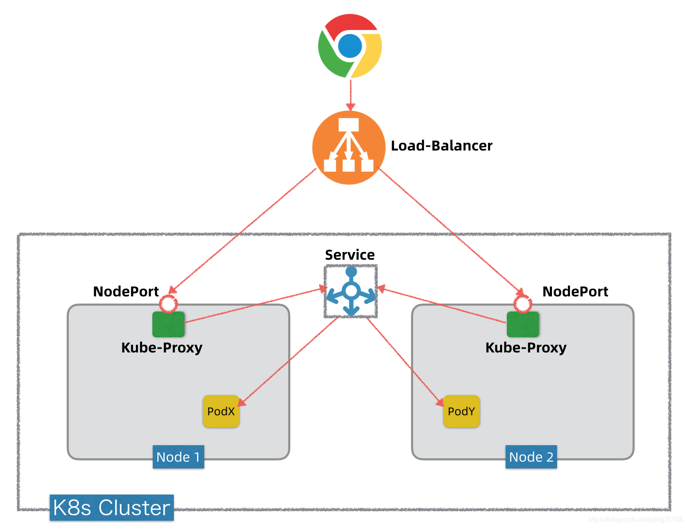

## Service设计理念

service用于为一组提供服务的pod抽象一个稳定的网络访问地址，对服务用户屏蔽了提供服务Endpoint的变化。核心功能是负载均衡和服务发现。


## 基本原理

逻辑层面看，Service会指向endpoint，endpoint记录对应的pod的ip；service相当于一组Pod的LB，外部应用访问service时，service会通过挑选出提供具体服务的pod，将流量转发到指定的pod中。



service是借助每个Node上的kube-proxy程序实现其功能，kube-proxy管理service的访问入口和service的Endpoints。







kube-proxy代理模式有四种：

* userspace：由kube-proxy实现，效率最低
* iptables：通过设置iptables实现service到endpoint的分发，效率高；但某个endpoint不可用，会导致相应失败
* ipvs：通过Linux Kernel的netlink接口设置IPVS规则，效率和吞吐率最高；需要系统开启IPVS模块；且支持较多的负载均衡策略
* kernelspace：windows server上用的


## service访问方式

1. 集群内部

* ClusterIP：默认会生成一个虚拟IP，加上端口，便可以为pod提供访问
* 服务名：依靠k8s DNS解析，通过namespace.serviceName：port即可访问
* 通过环境变量：在同一个 namespace 里的 pod 启动时，K8s 会把 service 的一些 IP 地址、端口，以及一些简单的配置，通过环境变量的方式放到 K8s 的 pod 里面。在 K8s pod 的容器启动之后，通过读取系统的环境变量比读取到 namespace 里面其他 service 配置的一个地址，或者是它的端口号等等。比如在集群的某一个 pod 里面，可以直接通过 curl $ 取到一个环境变量的值，比如取到 MY_SERVICE_SERVICE_HOST 就是它的一个 IP 地址，MY_SERVICE 就是刚才我们声明的 MY_SERVICE，SERVICE_PORT 就是它的端口号，这样也可以请求到集群里面的 MY_SERVICE 这个 service。

2. Headless service：Pod通过service name直接解析到所有后端Pod IP，客户端自己选择。在定义中设置`ClusterIP`

3. 向外暴露服务
   
   
   
   * NodePort：每个node都会暴露集群中服务的端口，通过每个node都可以路由到指定pod。NodePort背后是Kube-Proxy，Kube-Proxy是沟通Service网络、Pod网络和节点网络的桥梁。
   * LoadBalancer：在NodePort上面加了load balance，把所有它接触到的流量负载均衡到NodePort上。然后NodePort再转化成 ClusterIP，去访问到实际的 pod 上面


4. service的port

```yaml
apiVersion: v1
kind: Service
metadata:
  labels:
    name: app1
  name: app1
  namespace: default
spec:
  type: NodePort
  ports:
  - port: 8080 #service暴露在cluster ip上的端口，<cluster ip>:port 是提供给集群内部客户访问service的入口
    targetPort: 8080 #targetPort是pod上的端口，从port和nodePort上到来的数据最终经过kube-proxy流入到后端pod的targetPort上进入容器
    nodePort: 30062 # <nodeIP>:nodePort 是提供给集群外部客户访问service的入口
  selector:
    name: app1
    
```


## 常用命令

* 会话保持机制：保证请求转发到相同pod，配置service.spec.sessionAffinity = ClientIP

* 将外部服务定义为service

  * 创建service时不需要设置Label Selector

  * 定义一个与service关联到Endpoint资源

    ```yaml
    apiVersion: v1
    kind: Endpoint
    metadata:
      name: my-service
    subsets:
    - addresses:
      - IP: 1.2.3.4
      ports:
      - port: 80
    ```

* 快速创建service

  ```shell
  kubectl expose deploy webapp
  ```


## 其它功能

### 端点分片（Endpoint Slices）

当endpoint增多时，kube-proxy需要维护的负载分发规则也会急剧增大，EndpointSlice将Endpoint分片管理，分片内部只保存分片内的负载分发规则，避免了所有机器都保存整个集群的负载分发规则，从而降低维护成本。

### 服务拓扑

基于Node拓扑的服务路由，可以实现zone内流量的优先转发
