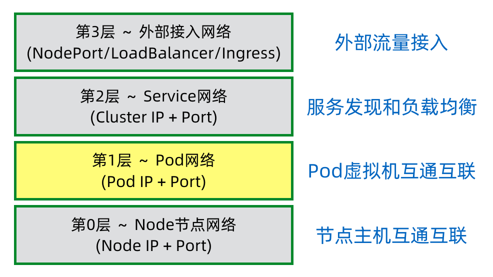
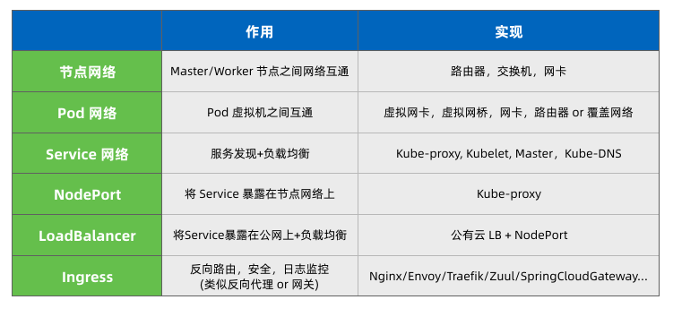
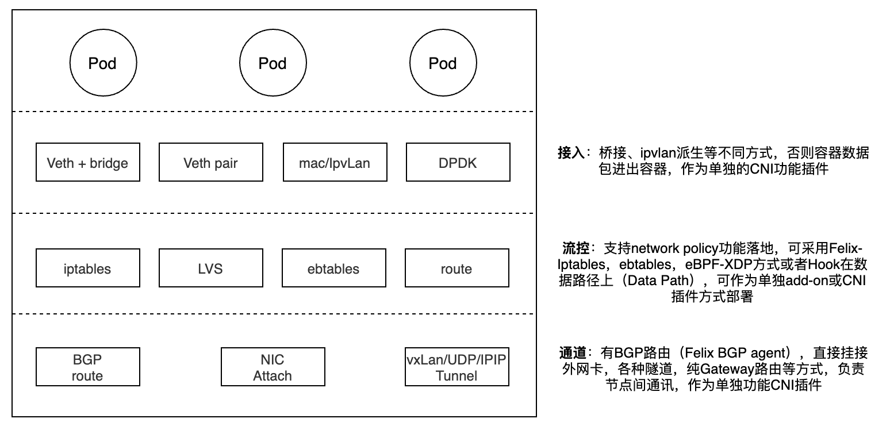
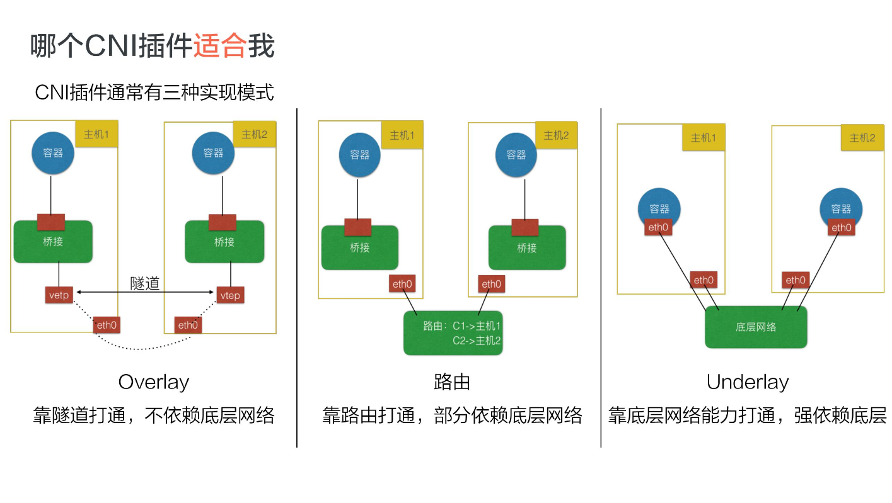
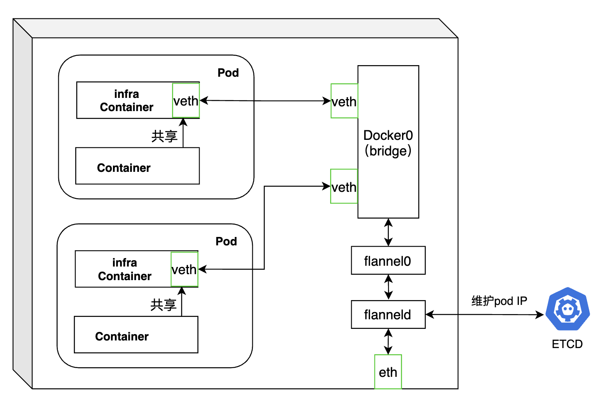
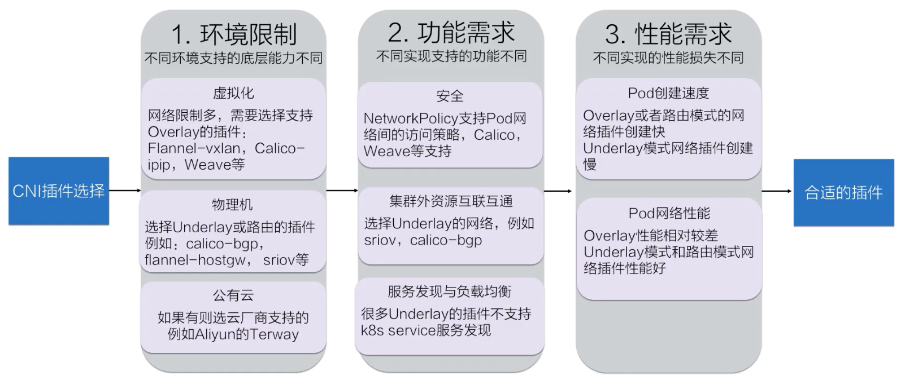

> ## 基础概念

* 二层网络 三层路由

  * 二层网络：是通过MAC地址获取目标，在数据链路层进行数据传递；好处是不需要解封包，效率高；坏处是所有机器必须同在一个子网，只能通过交换机连接，机器数量有限
  * 三层路由：需要通过IP进行寻址；好处是网络可以更加复杂、规模更大；坏处是性能相对二层网络低

  

## Kubernetes的网络分层

Kubernetes的网络分层与OSI七层网络侧重不同，kubernetes的四层网络是从kubernetes网络功能层面描述的。





## 容器网络模型

### docker网络局限性

docker的网络是通过创建docker0网桥设备，使docker容器实现与外部通信。这个过程中由于docker0网桥的存在，每个物理机上的容器与外部网络处于不同的网段，无法直接与外部网络通信，更无法实现不同主机上容器的直接通信。目前，都需要进行NAT转换才能通信，也就导致docker容器内部看到自身的网络ip（docker0的子网ip）与物理机外部看到的容器的公网ip不一致。


### CNM与CNI网络模型

* CNM通过Network sandbox、Endpoint、Network实现。容器中会有一个Network sandbox，network sanbox中会有一个或多个Endpoint；Network实现多个Endpoint的相连，从而实现容器的网络连通
* CNI表示通过绑定网络插件的模式加入网络中，它只定义了容器运行环境与网络插件之间的接口规范，网络插件则由不同的供应商实现；容器拥有独立的Linux网络命名空间，可以绑定多个网络插件加入多个网络；每个网络则要具体实现使用该插件的容器能够相互连接，且各自拥有独立、唯一的IP

### k8s采用的网络模型

k8s采用CNI的网络模型，本身不自带网络控制，由第三方组件进行网络实现。网络模型的要求本质是IP-per-Pod，在网络层面做到可以将每个pod看作集群中相互直连的独立虚拟机或物理机。k8s网络要求如下：

- 第一条：任意两个 pod 之间其实是可以直接通信的，无需经过显式地使用 NAT 来接收数据和地址的转换；
- 第二条：node 与 pod 之间是可以直接通信的，无需使用明显的地址转换；
- 第三条：pod 看到自己的 IP 跟别人看见它所用的IP是一样的，中间不能经过转换。

### CNI网络方案

容器网络方案由三部分构成：接入+流控+通道

* 接入：是容器与宿主机用哪种机制做连接，如：Veth+bridge，Veth+pair，Mac，IPvlan
* 流控：看方案是否支持network policy，以及怎么支持
* 通道：两个主机通过什么方式完成包的传输




### 主流容器网络实现方案

CNI三种实现模式：



#### Flannel （overlay方案）

* 方案：

维护pod IP方案：flanneld借助etcd维护所有pod的IP，保证所有pod的ip唯一。然后通过修改docker启动参数，指定每个pod的IP。

pod到pod网络通信方案：通过对docker0传输数据的包装，利用物理网络转发到目标pod所在机器，再由目标机器的flanneld解包，转发给目标pod

* 劣势：

需要封包、解包，有网络的性能损耗



#### 直接路由方案

方案：

维护pod IP方案：需要事先规划好

pod到pod网络通信方案：在交换机中配置每个docker0子网到Node到路由项，在linux系统中配置docker0与Node的匹配关系，这样实现pod到pod到网络的连通。

劣势：

需要维护路由项，集群规模大时，会有很大工作量

#### Calico

* 方案

  维护pod IP方案：也是借助etcd进行pod的IP维护

  pod到pod网络通信方案：caolico默认模式是BGP，该模式利用linux内核实现虚拟路由器进行数据转发；每个虚拟路由vRouter通过BGP1协议将路由信息对整个calico网络广播，自动扩展各个节点路由规则。当网络规模小，集群节点处于一个子网中时，可以通过上面的方式直连；当规模较大时，需要额外的BGP route reflector实现分级路由分发。这种模式时underlay的方案。

  calico也可以通过设置IP Pool的模式为IPIP，采用节点间搭建隧道模式进行网络传输，这种模式就需要封包、解包，造成性能损耗了。这是中overlay的方案。

### 选择CNI的方法




### Network Policy

用于网络隔离，相当于一个pod网路连通的白名单。基本原理是：通过选择器找到一组pod，再通过流的特征描述决定他们之间能否连通。选用的CNI插件要能够支持Network Policy，k8s没有内在实现。

```yaml
kind: NetworkPolicy
apiVersion: networking.k8s.io/v1
metadata:
  name: backend-policy
  namespace: development
spec:
  podSelector:  #控制对象选择器
    matchLabels:
      app: webapp
      role: backend
  ingress: # 流入控制
  - from:
    - namespaceSelector: {}
      podSelector:
        matchLabels:
          app: webapp
          role: frontend
  engross: #流出控制
  - to:
    - ipBlock:
      cidr: 10.0.0.0/24
```


## Pod的DNS

1. pod的DNS域名为<pod-ip>.<namespace>.pod.<cluster-domain>,其中pod-ip中要用“-”替换“."，如：10-0-95-63.default.pod.cluster.local是ip为10.0.95.63的pod的DNS域名

2. Pod的DNS策略

* Default：继承pod所在宿主机的域名解析设置
* ClusterFirst：优先使用k8s环境中的DNS服务
* ClusterFirstWithHostNet：适用于以hostNetwork工作的Pod
* None：忽略k8s的DNS配置，需要手工通过dnsConfig自定义DNS配置
