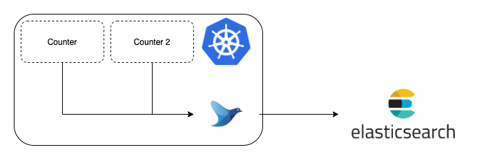

## 监控

k8s监控有三种接口：

* Resource Metrics

  对应的接口是 metrics.k8s.io，主要的实现就是 metrics-server，它提供的是资源的监控，比较常见的是节点级别、pod 级别、namespace 级别、class 级别。这类的监控指标都可以通过 metrics.k8s.io 这个接口获取到。

* Custom Metrics

  对应的 API 是 custom.metrics.k8s.io，主要的实现是 Prometheus。它提供的是资源监控和自定义监控，资源监控和上面的资源监控其实是有覆盖关系的，而这个自定义监控指的是：比如应用上面想暴露一个类似像在线人数，或者说调用后面的这个数据库的 MySQL 的慢查询。这些其实都是可以在应用层做自己的定义的，然后并通过标准的 Prometheus 的 client，暴露出相应的 metrics，然后再被 Prometheus 进行采集。

* External Metrics

  external.metrics.k8s.io。主要的实现厂商就是各个云厂商的 provider，通过这个 provider 可以获取云资源的监控指标。

## 日志

fluentd以sidecar模式收集日志存储到elasticsearch，再在Kibana中展示

