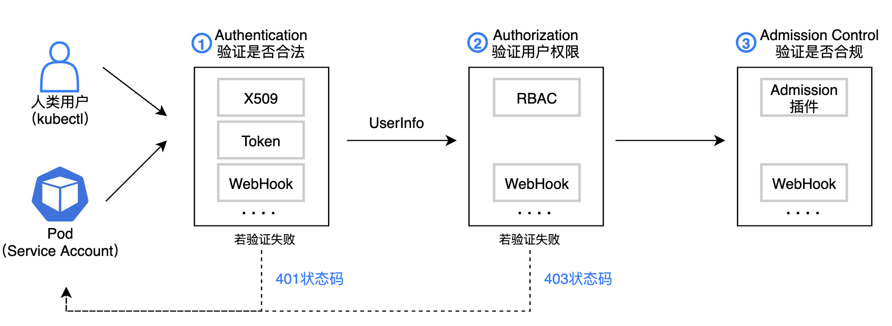

# 作用



创建对象时，校验用户身份后，会通过admission controller的验证。在这一步可以做功能的扩展。

可以定义两种Admission webhook：

* ValidatingAdmissionWebhook

  用于验证创建对象，是否允许资源创建

* MutatingAdmissionWebhook

  在开始创建对象时，请求会先发到编写的controller中，做一些操作。如：注入操作、优化

# 开发自己的Admission webhook

## 前提

* v1.16(to use `admissionregistration.k8s.io/v1`)或者v1.9(to use `admissionregistration.k8s.io/v1beta1`)
*  开启`--enable-admission-plugins`

* 开启admissionregistration.k8s.io/v1或admissionregistration.k8s.io/v1beta1

## 1. 开发webhook server

https://github.com/kubernetes/kubernetes/blob/release-1.21/test/images/agnhost/webhook/main.go

## 2. 部署

需要用deployment和service部署

## 3. 配置webhook

```yaml
apiVersion: admissionregistration.k8s.io/v1
kind: ValidatingWebhookConfiguration
metadata:
  name: "pod-policy.example.com"
webhooks:
- name: "pod-policy.example.com"
  rules:
  - apiGroups:   [""]
    apiVersions: ["v1"]
    operations:  ["CREATE"]
    resources:   ["pods"]
    scope:       "Namespaced"
  clientConfig:
    service:
      namespace: "example-namespace"
      name: "example-service"
    caBundle: "Ci0tLS0tQk...<`caBundle` is a PEM encoded CA bundle which will be used to validate the webhook's server certificate.>...tLS0K"
  admissionReviewVersions: ["v1", "v1beta1"]
  sideEffects: None
  timeoutSeconds: 5
```