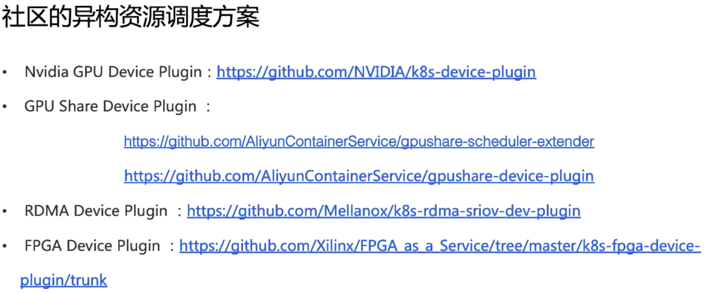

## kubernets原生GPU管理

两种机制

* Extend Resources：允许用户自定义资源名称。度量是整数级别；是一种Node级别的api，只需要通过PATCH API对Node对象的status部分更新即可

  

* Device Plugin Framework允许第三方设备提供商以外置方式对设备进行全生命周期管理，Device Plugin Framework建立Kubernetes和Devices Plugin之间的桥梁，负责设备信息上报和调度选择;每个硬件都需要Device Plugin进行管理，通过GRPC于kubelet的Device Plugin Manager进行连接，

  

  需要注意的是 kubelet 在向 api-server 进行汇报的时候，只会汇报该 GPU 对应的数量。而 kubelet 自身的 Device Plugin Manager 会对这个 GPU 的 ID 列表进行保存，并用来具体的设备分配。而这个对于 Kubernetes 全局调度器来说，它不掌握这个 GPU 的 ID 列表，它只知道 GPU 的数量。

  这就意味着在现有的 Device Plugin 工作机制下，Kubernetes 的全局调度器无法进行更复杂的调度。比如说想做两个 GPU 的亲和性调度，同一个节点两个 GPU 可能需要进行通过 NVLINK 通讯而不是 PCIe 通讯，才能达到更好的数据传输效果。在这种需求下，目前的 Device Plugin 调度机制中是无法实现的。

## 社区方案

1. GPU共享调度-阿里

   按GPU的Memory去切分，多个任务可以调度到同一个卡上

   https://github.com/AliyunContainerService/gpushare-scheduler-extender

       apiVersion: apps/v1beta1
       kind: StatefulSet
       
       metadata:
         name: binpack-1
         labels:
           app: binpack-1
       
       spec:
         replicas: 3
         serviceName: "binpack-1"
         podManagementPolicy: "Parallel"
         selector: # define how the deployment finds the pods it manages
           matchLabels:
             app: binpack-1
       
         template: # define the pods specifications
           metadata:
             labels:
               app: binpack-1
       
           spec:
             containers:
             - name: binpack-1
               image: cheyang/gpu-player:v2
               resources:
                 limits:
                   # GiB
                   aliyun.com/gpu-mem: 3

2. Volcano device plugin

   https://github.com/volcano-sh/devices