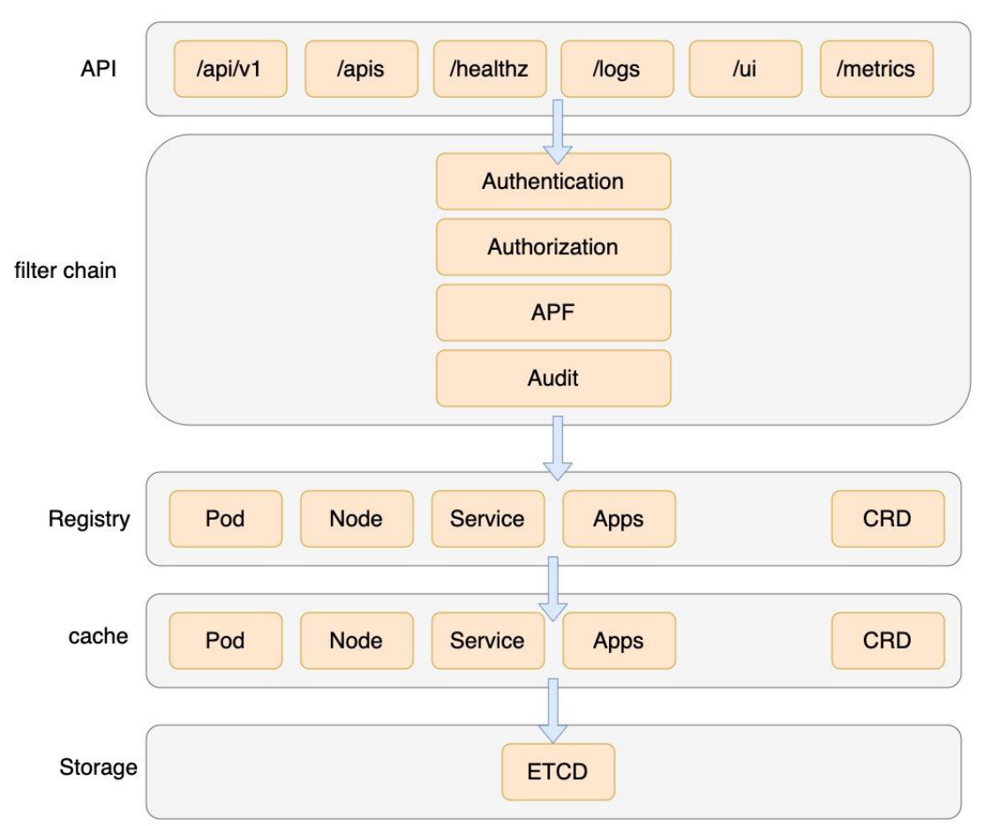

## 功能

* 提供对集群资源CRUD的接口
* 提供缓存和list-watch方式，保证客户端实时获取对象状态

## 架构



kubernetes把所有资源对象保持在registery，各种资源对象都定义了对象的类型、如何创建对象、如何转换不同版本


客户端首先调用API server的List接口获取相关资源对象的全量数据并缓存到内存中，然后启动对应资源对象的Watch协程，watch事件后，根据事件类型对内存中的资源同步修改，从而实现高性能、近乎实时的数据同步。

每种资源类型都有一个相对不变的internal版本，每个版本都有与internal进行转换的方法，从而实现任意版本间的转换。

## 代理接口

* Node相关代理，kubelet负责响应请求

  ```yaml
  /api/v1/nodes/{name}/proxy/pods #获取指定节点所有pod信息
  /api/v1/nodes/{name}/proxy/stats #获取指定节点物理资源的统计
  /api/v1/nodes/{name}/proxy/spec #获取指定节点概要信息
  ```

* Pod相关代理

  ```yaml
  /api/v1/proxy/namespaces/{namespace}/pods/{name}/{path:*} # 访问Pod的某个服务接口
  /api/v1/proxy/namespaces/{namespace}/pods/{name} # 访问Pod
  /api/v1/namespaces/{namespace}/pods/{name}/proxy/{path:*} # 访问Pod的某个服务接口
  /api/v1/namespaces/{namespace}/pods/{name}/proxy # 访问Pod
  ```

* service相关代理

  ```yaml
  /api/v1/proxy/namespaces/{namespace}/services/{name} #访问服务
  ```

  

## API Server网络隔离设计

Master节点网络与Node网络隔离，保证网络安全。

方案是：master网络中部署Konnectivity server，node节点网络中部署Konnectivity Agent，两者建立安全连接。