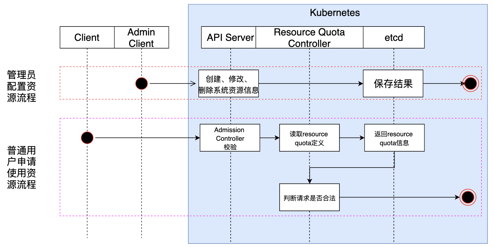

Controller Manager内部包含Replication Controller、Node Controller 、 ResourceQuota Controller 、 Namespace Controller 、ServiceAccount Controller 、 Token Controller 、 Service Controller 、Endpoint Controller、Deployment Controller、Router Controller、Volume Controller等各种资源对象的控制器。

## 控制器工作原理

控制器与ETCD配合使用，ETCD用于保存对象的数据，控制器会监控ETCD中其管理对象的变化，根据数据变化执行相应的动作。

## Resource Quota

用户在创建资源时，admission controller会先根据Resource Quota控制的数据校验用户资源是否超出限制。