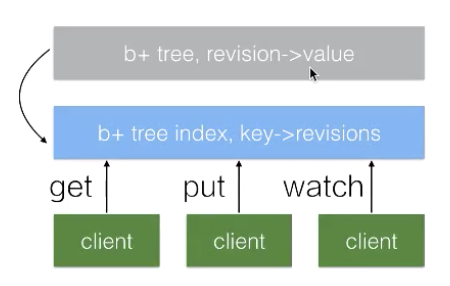
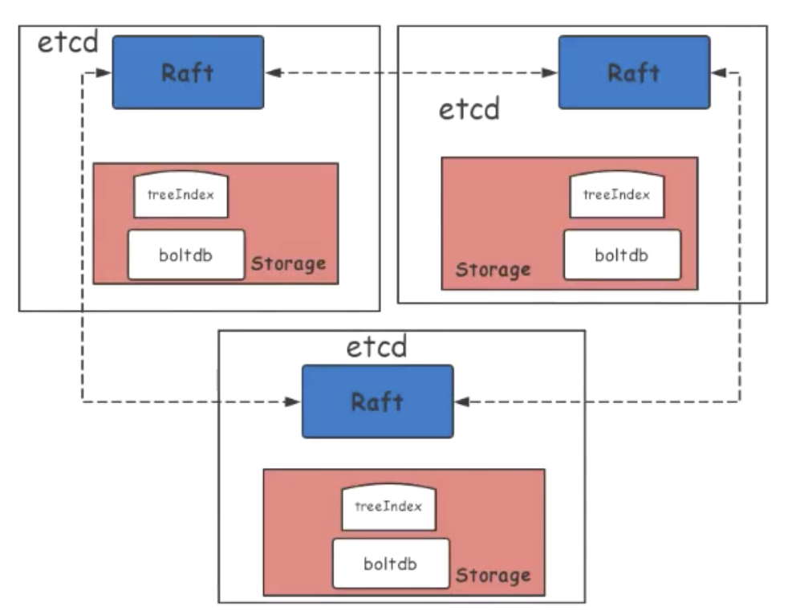

Etcd是分布式的可靠的key-value存储

## 机制

Etcd通过Raft算法保证数据的一致性，只要有超过半数的节点数保持工作，并可以正常对外提供服务。term表示主节点任期号，主节点发生变化就加一，revision是数据全局版本号，数据发生变化就加一

查询数据时，先通过index，key-》revision b+树查询到revision，再通过revision->value b+ 树找到对应的value

## 使用

* put(key, value) 
* Delete(key)
* Get(key) / Get(keyFrom, keyEnd)
* Watch(key/keyPrefix): 监控key的变化
* Transeactions(if/ then/ else ops).Commit()
* Leases:Grant/Revoke/KeepAlive

## leases

代表一个租约，时间到了后，租约到期，etcd就会进行清理与lease绑定的key。

## Etcd性能优化

Etcd架构简图如下，raft层会有网络性能的阻碍，storage层有磁盘IO延迟的影响，索引层的锁，boltdb Tx 的锁以及 boltdb 本身的性能也会有影响

* 硬件部署上：采用ssd硬盘，尽量独立部署来保证cpu和内存
* 客户端操作
  * 针对于 Put 操作避免使用大 value，精简精简再精简，例如 K8s 下的 crd 使用；
  * 其次，etcd 本身适用及存储一些不频繁变动的 key/value 元数据信息。因此客户端在使用上需要避免创建频繁变化的 key/value。这一点例如 K8s下对于新的 node 节点的心跳数据上传就遵循了这一实践；
  * 最后，我们需要避免创建大量的 lease，尽量选择复用。例如在 K8s下，event 数据管理：相同 TTL 失效时间的 event 同样会选择类似的 lease 进行复用，而不是创建新的 lease。
