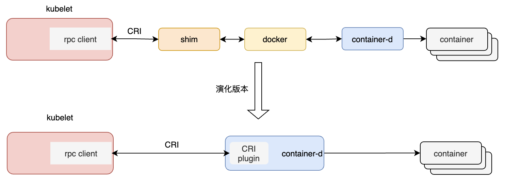

### kubelet职责

* 启动后，注册节点信息；定期上报节点资源的使用情况

* 通过RPC管理Pod的生命周期，实现容器生命周期的钩子、存活、健康监测，以及执行pod重启策略

### CRI容器运行时

* 目的：实现k8s与容器方案的解耦；通过开放容器操作接口标准，不同的供应商实现自己的容器方案，k8s便可以使用多样的容器方案。

* kubelet与CRI中的container-d协作模式如下

  

