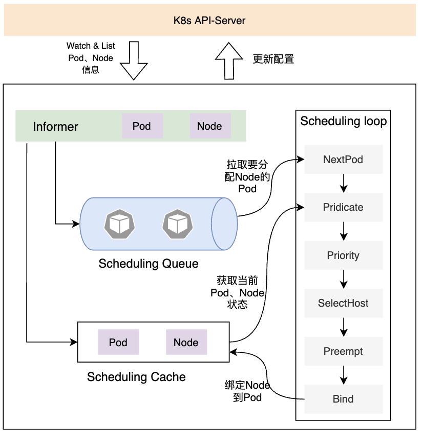
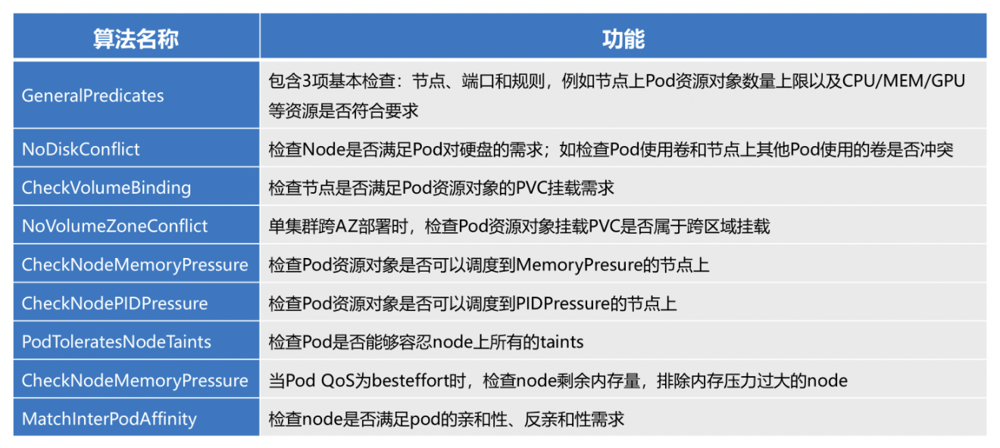
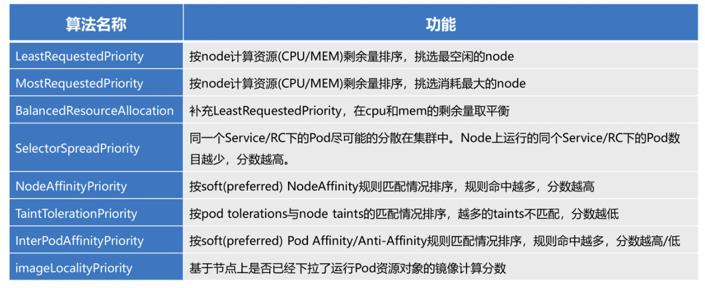

## 调度器原理

### 第一版调度器原理

informer不断从api server中拉取pod和node的信息，对没有绑定node的pod会放到调度队列中，pod和node信息则放在缓存中。调度器的调度循环中：

* 第一步是拉取一个要处理的pod
* 在Pridicate阶段过滤不符合的Node
* 在Priority阶段给每个合适node打分
* 根据得分选择Node
* 当没有合适Node，则对优先级低pod进行抢占
* 绑定pod到Node（Pod对象添加Node的信息），提到缓存中，写入ETCD中

### 新版调度器

采用scheduler framework，在旧的流程基础上增加了扩展点，支持用户以插件的方式进行扩展。Scheduling Framework 在执行调度流程时，当运行到扩展点时，会调用我们注册的插件，通过执行自定义插件的策略，满足调度需求。此外，一个插件可以在多个扩展点注册，用以执行更复杂或有状态的任务。

扩展点：

* QueueSort：对待调度的Pod进行排序
* PreFilter：过滤前的预处理
* Filter：是Predicates阶段，过滤不能运行Pod的节点
* PreScore：预打分
* Score：节点打分
* Reserve：资源预留给Pod时，通知插件
* Premit：可以阻止或延迟Pod绑定
* PreBind：绑定节点前执行
* Bind：将节点与Pod绑定
* PostBind：在Pod绑定后调用

#### Scheduling Framework调度器的扩展方案

1. 通过代码实现插件逻辑
2. 用Deployment对象部署扩展插件程序
3. 通过定义KubeSchedulerConfiguration，在k8s集群中注入自己开发的插件
4. 在Pod中的schedulerName指定KubeSchedulerConfiguration创建的新scheduler，来使用扩展后的调度器

## 算法

Predicate算法

Priority算法

## 多调度器方案

* 添加自定义调度器
* 通过scheduler profile对调度器进行不同的配置，实现多调度器的特性
