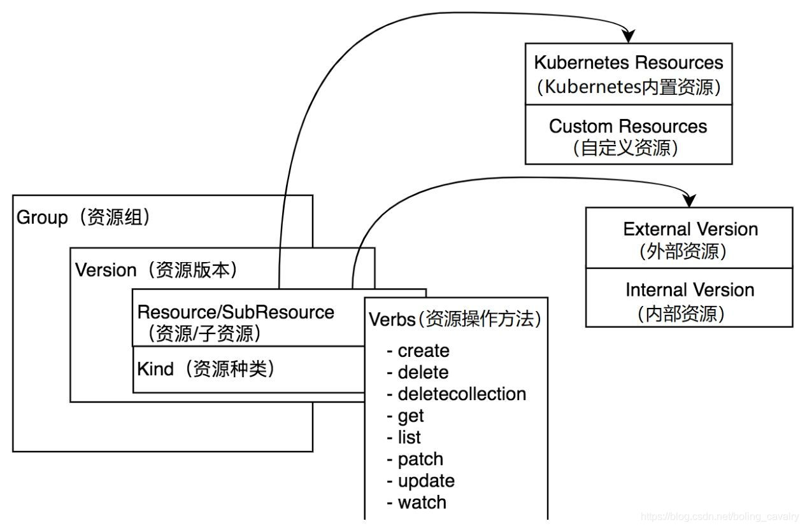
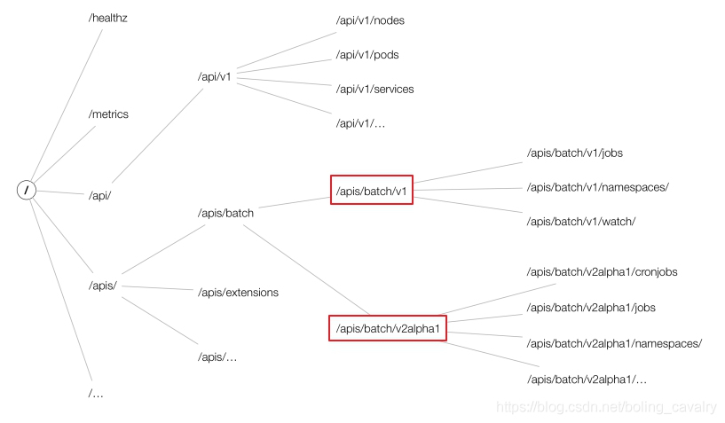
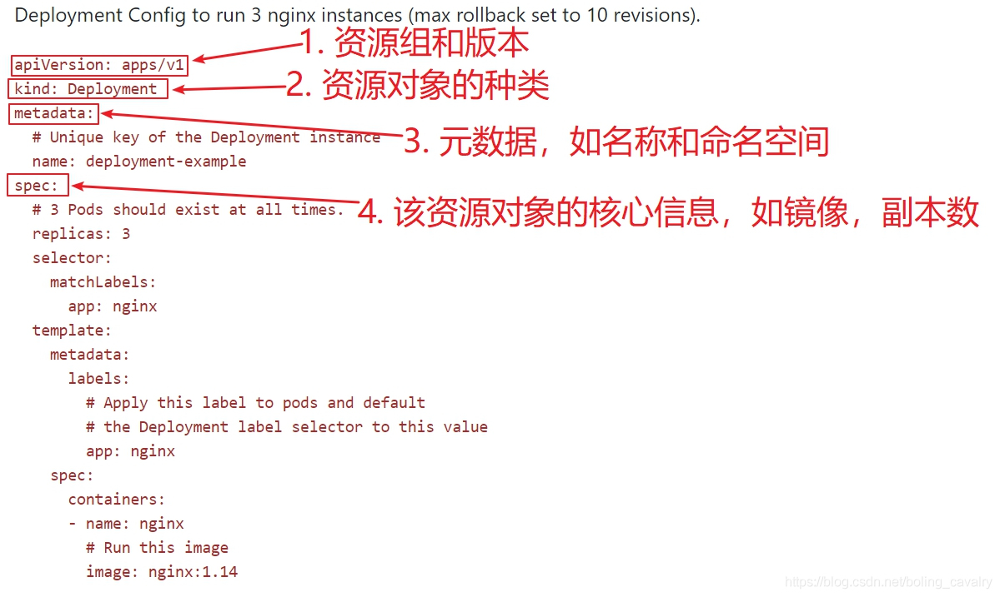
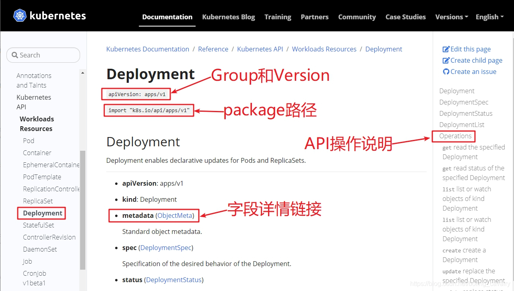
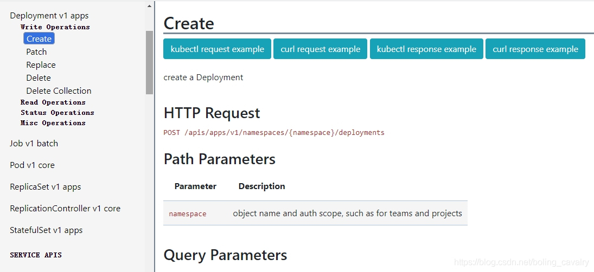

### Kubernetes的Group、Version、Resource、Kind浅解



#### Group

Group即资源组，在kubernetes对资源进行分组时，对应的数据结构就是Group，源码路径：staging/src/k8s.io/apimachinery/pkg/apis/meta/v1/types.go
，如下，可见Group有自己的名称和版本：

```markdown
type APIGroup struct {
	TypeMeta `json:",inline"`
	Name string `json:"name" protobuf:"bytes,1,opt,name=name"`
	Versions []GroupVersionForDiscovery `json:"versions" protobuf:"bytes,2,rep,name=versions"`
	PreferredVersion GroupVersionForDiscovery `json:"preferredVersion,omitempty" protobuf:"bytes,3,opt,name=preferredVersion"`
	ServerAddressByClientCIDRs []ServerAddressByClientCIDR `json:"serverAddressByClientCIDRs,omitempty" protobuf:"bytes,4,rep,name=serverAddressByClientCIDRs"`
}
```

在kubernetes中有两种资源组：有组名资源组和无组名资源组(也叫核心资源组Core Groups)，它们都很常见：
例子：deployment有组名，pod没有组名，把它俩的OpenAPI放在一起对比就一目了然了


#### Version

Version即版本，这个好理解，kubernetes的版本分为三种：

> Alpha：内部测试版本，如v1alpha1
>
> Beta：经历了官方和社区测试的相对稳定版，如v1beta1
>
> Stable：正式发布版，如v1、v2

如下图红框，资源组batch之下有v1和v2alpha1两个版本，每个版本下都有多个资源：

数据结构源码还是在staging/src/k8s.io/apimachinery/pkg/apis/meta/v1/types.go文件中，如下：

```markdown
type APIVersions struct {
	TypeMeta `json:",inline"`
	Versions []string `json:"versions" protobuf:"bytes,1,rep,name=versions"`
	ServerAddressByClientCIDRs []ServerAddressByClientCIDR `json:"serverAddressByClientCIDRs" protobuf:"bytes,2,rep,name=serverAddressByClientCIDRs"`
}
```

#### Resource

Resource资源在kubernetes中的重要性是不言而喻的，常见的pod、service、deployment这些都是资源。

> 在kubernetes环境被实例化的资源即资源对象(ResourceObject)
>
> 资源被分为持久性（Persistent Entity）和非持久性（Ephemeral Entity），持久性如deployment，创建后会在etcd保存，非持久性如pod
>
> kubernetes为资源准备了8种操作：create、delete、deletecollection、get、list、patch、update、watch，每一种资源都支持其中的一部分，这在每个资源的API文档中可以看到
>
> > 增：
> >
> > create：Resource Object 创建
> > 删：
> >
> > delete：单个 Resource Object 删除
> >
> > deletecollection：多个 Resource Objects 删除
> >
> > 改：
> > patch：Resource Object 局部字段更新
> >
> > update：Resource Object 整体更新
> >
> > 查：
> >
> > get：单个 Resource Object 获取
> >
> > list：多个 Resource Objects 获取
> >
> > watch：Resource Objects 监控
>
> 资源支持以命名空间（namespace）进行隔离
>
> 资源对象描述文件在日常操作中频繁用到，一共由五部分组成：apiVersion、kind、metadata、spec、status，下图是官方的deployment描述文件，用于创建3个nginx pod，对着红框和文字就了解每个部分的作用了


## Metadata字段概念

### Labels

标识型key：value元数据，用于筛选资源，组合资源的唯一方式

### Selector

用于类似SQL语句，对Labels进行选择

### annotations

用于存储资源的非标识性信息，扩展资源的spec/status。

### ownereference

表明父级资源对象，方便方向查找和级联删除


上图并没有status，该部分是用来反应当前资源对象状态的，体现在资源的数据结构中，如下所示:

```markdown
type Deployment struct {
	metav1.TypeMeta `json:",inline"`
	metav1.ObjectMeta `json:"metadata,omitempty" protobuf:"bytes,1,opt,name=metadata"`
	Spec DeploymentSpec `json:"spec,omitempty" protobuf:"bytes,2,opt,name=spec"`
	Status DeploymentStatus `json:"status,omitempty" protobuf:"bytes,3,opt,name=status"`
}
```

数据结构源码还是在staging/src/k8s.io/apimachinery/pkg/apis/meta/v1/types.go文件中，如下：

```markdown
type APIResource struct {
	Name string `json:"name" protobuf:"bytes,1,opt,name=name"`
	SingularName string `json:"singularName" protobuf:"bytes,6,opt,name=singularName"`
	Namespaced bool `json:"namespaced" protobuf:"varint,2,opt,name=namespaced"`
	Group string `json:"group,omitempty" protobuf:"bytes,8,opt,name=group"`
	Version string `json:"version,omitempty" protobuf:"bytes,9,opt,name=version"`
	Kind string `json:"kind" protobuf:"bytes,3,opt,name=kind"`
	Verbs Verbs `json:"verbs" protobuf:"bytes,4,opt,name=verbs"`
	ShortNames []string `json:"shortNames,omitempty" protobuf:"bytes,5,rep,name=shortNames"`
	Categories []string `json:"categories,omitempty" protobuf:"bytes,7,rep,name=categories"`
	StorageVersionHash string `json:"storageVersionHash,omitempty" protobuf:"bytes,10,opt,name=storageVersionHash"`
}
```

#### Kind

Kind 与 Resource 属于同一级概念，Kind 用于描述 Resource 的种类

#### Scheme

每种资源的都需要有对应的Scheme，Scheme结构体包含gvkToType和typeToGVK的字段映射关系，APIServer 根据Scheme来进行资源的序列化和反序列化。

#### GV & GVK & GVR

> GV: Api Group & Version
>
> > API Group 是相关 API 功能的集合
> >
> > 每个 Group 拥有一或多个 Versions
>
> GVK: Group Version Kind
>
> > 每个 GV 都包含 N 个 api 类型，称之为 Kinds，不同 Version 同一个 Kinds 可能不同
>
> GVR: Group Version Resource
>
> > Resource 是 Kind 的对象标识，一般来 Kind 和 Resource 是 1:1 的，但是有时候存在 1:n 的关系，不过对于 Operator 来说都是 1:1 的关系

举个例子，我们在 k8s 中的 yaml 文件都有下面这么两行：

```markdown
apiVersion: apps/v1 # 这个是 GV，G 是 apps，V 是 v1
kind: Deployment    # 这个就是 Kind
sepc:               # 加上下放的 spec 就是 Resource了
  ...
```

根据 GVK K8s 就能找到你到底要创建什么类型的资源，根据你定义的 Spec 创建好资源之后就成为了 Resource，也就是 GVR。GVK/GVR 就是 K8s 资源的坐标，是我们创建/删除/修改/读取资源的基础。

```markdown
查看当前环境的所有资源，及其相关属性
# ctl api-resources -o wide
查看特定group下面的资源，例如：apps
# ctl api-resources --api-group apps -o wide
查看指定资源的详情,例如：configmap
# ctl explain configmap
查看所有Group和Version的命令
# ctl api-versions
```

#### 官方文档速查

在实际学习和开发中，对指定资源做增删改查操作时，官方文档是我们最可靠的依赖，地址：https://kubernetes.io/docs/reference/kubernetes-api/

打开deployment的文档，如下图：

另外还有API文档也是必不可少的，最新的是1.19版本，地址：https://v1-22.docs.kubernetes.io/docs/reference/generated/kubernetes-api/v1.22/

下图是deployment的api接口文档，可见示例、path、请求响应参数都有详细的说明：


#### APIResources数据结构

APIResource是个常用的数据结构了，可以用来描述资源，例如kubernetes/pkg/controller/resourcequota/resource_quota_controller_test.go中有对其的使用：

```markdown
func TestDiscoverySync(t *testing.T) {
	serverResources := []*metav1.APIResourceList{
		{
			GroupVersion: "v1",
			APIResources: []metav1.APIResource{
				{Name: "pods", Namespaced: true, Kind: "Pod", Verbs: metav1.Verbs{"create", "delete", "list", "watch"}},
			},
		},
	}
	unsyncableServerResources := []*metav1.APIResourceList{
		{
			GroupVersion: "v1",
			APIResources: []metav1.APIResource{
				{Name: "pods", Namespaced: true, Kind: "Pod", Verbs: metav1.Verbs{"create", "delete", "list", "watch"}},
				{Name: "secrets", Namespaced: true, Kind: "Secret", Verbs: metav1.Verbs{"create", "delete", "list", "watch"}},
			},
		},
	}
```

