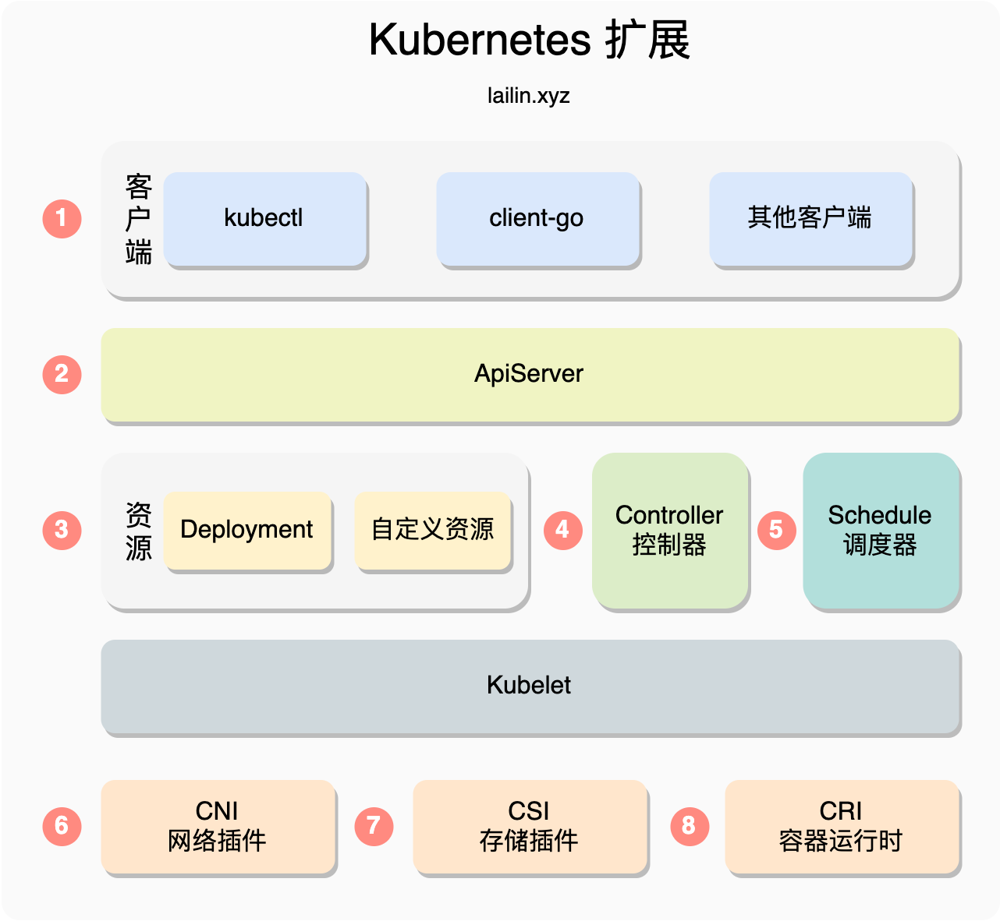

## 开发技巧

1. 暴露集群API到本地

   kubectl proxy --port=8080

2. OpenAPI文档地址

   http://<master-ip>:<master-port>/openapi/v2

   

#### Kubernetes 有哪些扩展点



##### kubectl

kubectl 插件其实就是以kubectl-为前缀的任意可执行文件 ，执行 kubectl 插件的时候可以通过 kubectl 插件名 参数 的方式运行插件。kubectl的插件管理工具 krew ，同时我们可以从 [https://krew.sigs.Kubernetes.io/plugins/](https://krew.sigs.kubernetes.io/plugins/) 查找是否已经存在我们需要的插件

##### APIServer

###### 聚合层

从 Kubernetes v1.7 版本之后 APIServer 引入了聚合层的功能，这个功能可以让每个开发者都能够实现聚合 API 服务暴露它们需要的接口，这个过程不需要重新编译 Kubernetes 的任何代码。

如果我们将下面这个资源提交给 Kubernetes 之后，用户在访问 API 服务器的 /apis/metrics.Kubernetes.io/v1beta1 路径时，会被转发到集群中的 metrics-server.kube-system.svc 服务上

```markdown
apiVersion: apiregistration.Kubernetes.io/v1
kind: APIService
metadata:
  name: v1beta1.metrics.Kubernetes.io
spec:
  service:
    name: metrics-server
    namespace: kube-system
  group: metrics.Kubernetes.io
  version: v1beta1
  insecureSkipTLSVerify: true
  groupPriorityMinimum: 100
  versionPriority: 100
```

###### 准入控制

除此之外无论是从 kubectl 还是 client-go 等其他客户端发起的请求都会发送到 APIServer 经过 认证 -> 鉴权 -> 准入控制 的步骤，这其中的每一步我们都可以对其进行扩展，而这其中用的最多的就是准入控制的扩展。

准入控制当中又会先经过，变更准入控制 MutatingAdmissionWebhook，然后再经过验证准入控制 ValidatingAdmissionWebhook，任何一个准入控制器返回了错误这个请求都会失败，例如这两个准入控制器我们可以做很多事情，例如注入 sidecar，验证资源，调整 pod 的配额等等。

##### Controller 控制器

Kubernetes 中资源的状态的维护都是 Controller 来实现的，Controller 会不断的尝试将一个资源调整为我们描述的状态，这其实也就是我们常说的声明式 api，声明式 api 背后具体的活都是 Controller 干的。Controller 一般会配合着 CRD（Custom Resource Definition） 一起使用

##### Schedule 调度器

调度器是一种特殊的控制器，负责监视 Pod 变化并将 Pod 分派给节点，调度器可以被直接替换掉或者是使用多个调度器，除此之外官方默认的调度器也支持 WebHook。

##### CNI 网络插件

CNI 网络插件，全称 Container Network Interface（容器网络接口）包含一组用于开发插件去配置 Linux 容器中网卡的接口和框架。一般我们不会去对网络插件做定制开发，而是采用开源的组件，例如 Flannel、Cilium，如果使用云服务的 Kubernetes 还会遇到一些定制的网络插件， 例如阿里云有 Terway

##### CSI 存储插件

CSI 存储插件，全称 Container Storage Interface，可以通过 CSI 接口支持不同的存储类型

##### CRI 容器运行时

CRI 容器运行时，全称 Container Runtime Interface，是一组用于管理容器运行时和镜像的 gRPC 接口，利用这个接口可以支持 docker、containerd 等不同的容器运行时


### CRD

CRD：自定义资源定义，Kubernetes 中的资源类型。

CR：Custom Resource，对使用 CRD 创建出来的自定义资源的统称

CRD 是用来扩展 Kubernetes 最常用的方式，在 Service Mesh 和 Operator 中也被大量使用。因此如果想在 Kubernetes 上做扩展和开发的话，是十分有必要了解 CRD 的。

官方文档：https://kubernetes.io/docs/tasks/extend-kubernetes/custom-resources/custom-resource-definitions/

#### 创建 CRD（CustomResourceDefinition）

创建新的 CustomResourceDefinition（CRD）时，Kubernetes API Server 会为您指定的每个版本创建新的 RESTful 资源路径。CRD 可以是命名空间的，也可以是集群范围的，可以在 CRD scope 字段中所指定。与现有的内置对象一样，删除命名空间会删除该命名空间中的所有自定义对象。CustomResourceDefinition 本身是非命名空间的，可供所有命名空间使用。

参考下面的 CRD，将其配置保存在 resourcedefinition.yaml 文件中：

```markdown
apiVersion: apiextensions.k8s.io/v1
kind: CustomResourceDefinition
metadata:
  # 名称必须符合下面的格式：<plural>.<group>
  name: crontabs.stable.example.com
spec:
  # REST API使用的组名称：/apis/<group>/<version>
  group: stable.example.com
  # REST API使用的版本号：/apis/<group>/<version>
  versions:
    - name: v1
      # 可以通过 served 来开关每个 version
      served: true
      # 有且仅有一个 version 开启存储
      storage: true
      schema:
        openAPIV3Schema:
          type: object
          properties:
            spec:
              type: object
              properties:
                cronSpec:
                  type: string
                image:
                  type: string
                replicas:
                  type: integer
  # Namespaced或Cluster
  scope: Namespaced
  names:
    # URL中使用的复数名称: /apis/<group>/<version>/<plural>
    plural: crontabs
    # CLI中使用的单数名称
    singular: crontab
    # CamelCased格式的单数类型。在清单文件中使用
    kind: CronTab
    # CLI中使用的资源简称
    shortNames:
    - ct
```

然后在以下位置创建一个新的命名空间 RESTful API 端点：

```markdown
/apis/stable.example.com/v1/namespaces/*/crontabs/...
```

然后，此端点 URL 可用于创建和管理自定义对象。上面的 CRD 中定义的类型就是 CronTab。

可能需要几秒钟才能创建端点。可以监控 CustomResourceDefinition 中 Established 的状态何时为 true，或者查看 API 资源的发现信息中是否显示了资源。

#### 创建自定义对象

创建 CustomResourceDefinition 对象后，您可以创建自定义对象。自定义对象可包含自定义字段。这些字段可以包含任意 JSON。在以下示例中， cronSpec 和 image 自定义字段在自定义对象中设置 CronTab。CronTab 类型来自您在上面创建的 CustomResourceDefinition 对象的规范。

如果您将以下 YAML 保存到 my-crontab.yaml：

```markdown
apiVersion: "stable.example.com/v1"
kind: CronTab
metadata:
  name: my-new-cron-object
spec:
  cronSpec: "* * * * */5"
  image: my-awesome-cron-image
```

并创建它：

```markdown
kubectl create -f my-crontab.yaml
```

然后，您可以使用 kubectl 管理 CronTab 对象。例如：

```markdown
kubectl get crontab
```

应该打印这样的列表：

```markdown
NAME                 AGE
my-new-cron-object   6s
```

...
https://jimmysong.io/kubernetes-handbook/concepts/crd.html

https://liqiang.io/post/kubernetes-all-about-crd-part01-crd-introduction-fb14d399

### Operator简介

官方对Operator的介绍：https://kubernetes.io/zh/docs/concepts/extend-kubernetes/operator/ ，Operator模式的执行流程如下图所示：

Operator 遵循 Kubernetes 的理念，它利用自定义资源管理应用及其组件， Operator 模式会封装你编写的任务自动化代码。

Operator 常见使用范围包括:

> 按需部署应用
>
> 获取/还原应用状态的备份
>
> 处理应用代码的升级以及相关改动。例如，数据库 schema 或额外的配置设置
>
> 发布一个 service，要求不支持 Kubernetes API 的应用也能发现它
>
> 模拟整个或部分集群中的故障以测试其稳定性
>
> 在没有内部成员选举程序的情况下，为分布式应用选择首领角色

从 Operator 理念的提出到现在已经有了很多工具可以帮助快速低成本的开发，其中最常用的就是 CoreOS 开源的 operator-sdk 和 k8s sig 小组维护的 kubebuilder。

除了自己开发之外还可以在 https://operatorhub.io/ 上找到别人开发的现成的 Operator 进行使用
