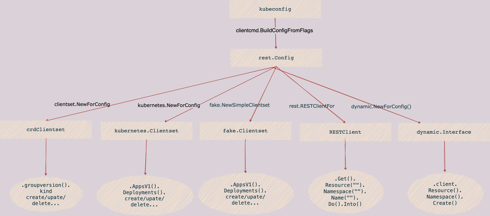
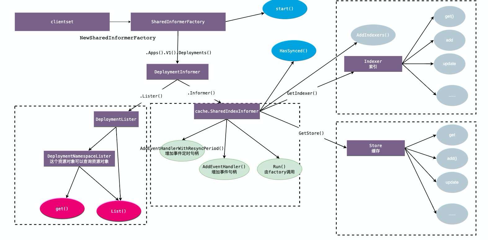
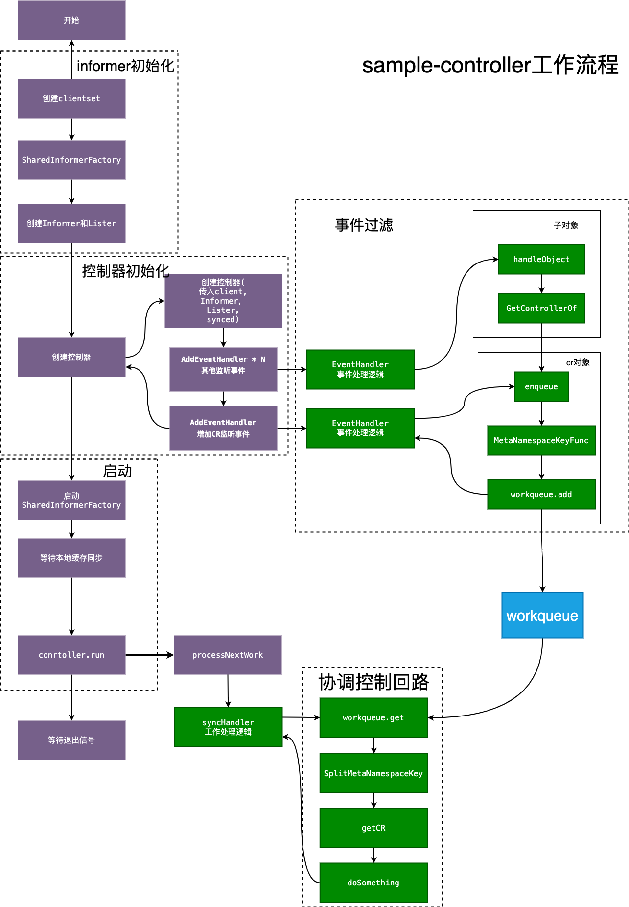

# client-go

client-go是一个调用kubernetes集群资源对象API的客户端，主要的几个package包的功能说明如下：

- kubernetes: 提供 ClientSet 客户端。
- dynamic: 提供 DynamicClient 动态客户端。
- rest: 提供 RESTClient 客户端，对 K8S API Server 执行 RESTful 操作。
- scale: 提供 ScaleClient 客户端，用于扩容或缩容 Deployment, Replicaset, Replication Controller 等资源对象。
- informers: 每种 K8S 资源的 Informer 实现。
- listers: 为每一个 K8S 资源提供 Lister 功能，该功能对 Get 和 List 请求提供只读的缓存数据。
- plugin: 提供 OpenStack，GCP 和 Azure 等云服务商授权插件。
- tools: 提供常用工具，例如 SharedInformer, Relector, DealtFIFO 及 Indexers。提供 Client 查询和缓存机制
- transport: 提供安全的 TCP 连接，支持 HTTP Stream，某些操作需要在客户端和容器之间传输二进制流，例如 exec，attach 等操作。该功能由内部的 SPDY 包提供支持。
- util: 提供常用方法。例如 WorkQueue 工作队列，Certificate 证书管理等。

## client

client的应用场景

| client               | 使用场景                                                     |
| -------------------- | ------------------------------------------------------------ |
| kubernetes.clientset | 针对标准包里面的资源进行处理，需要传入client.go内部定义的对象 |
| fake.clientset       | 虚拟的客户端，通常用在单元测试                               |
| <crd>.clientset      | 操作crd资源，需要手动生成代码                                |
| dynamiClient         | 动态客户端，不限定内部api, 可以操作crd资源。需要提供unstructured的对象(map) |
| restfulClient        | 直接使用restful方式进行请求，提供http最底层的操作，需要提供runtime.object的对象 |

编码参考

clientset参考

https://github.com/kubernetes/client-go/blob/master/examples/create-update-delete-deployment/main.go#L66

Fakclientset参考

https://github.com/kubernetes/client-go/blob/master/examples/fake-client/main_test.go#L85

dynamiClient参考

https://github.com/kubernetes/client-go/blob/master/examples/dynamic-create-update-delete-deployment/main.go#L69

## Informer架构

- Reflector list/watch 到本地
- Delta FIFO 事件队列
- Informer 事件通知
- Indexer  本地索引
- Store 本地缓存

### informer编码参考

1. 初始化rest.config

2. 初始化clientset(包含多个client，kubernetes.clientset/crd.client)

3. 通过clientset，初始化SharedInformerFactory

4. 通过Factory，首先获取Informer 接口 (提供方法可以获取cache.SharedIndexInformer 和 xxxLister); Informer在创建时，根据创建informer对象，初始化reflactor，定义reflactor要从api-server中list/watch informer实例化对应的对象

5. 通过cache.SharedIndexInformer 设置事件的处理，xxxLister提供后期get/list方法; 通常会将获取的对象放到workqueue中让worker去处理

6. 执行Factory.start, 整个informer开始启动

7. 等待所有缓存建立(cache.WaitForCacheSync), informer启动完毕

8. 事件处理负责过滤并入队，并循环出队处理

   

