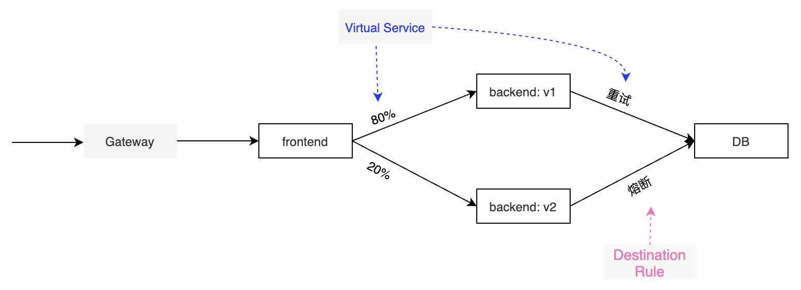
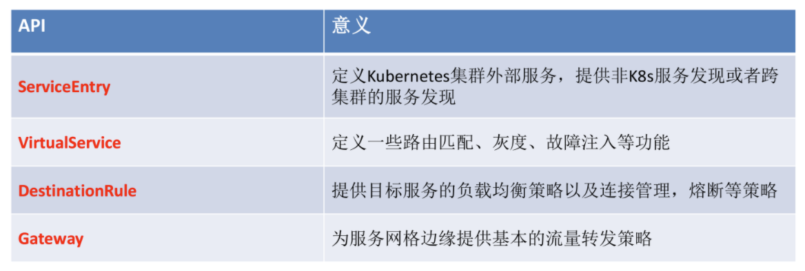

配置中几个核心概念：



## 使用服务网格的要求

* pod必须关联service，要包含两个标签：app和version
* 命名服务端口：http，http2，mongo，redis，grpc


## Gateway

指定要进入或者离开网格的流量，运行于网格边界的独立Envoy代理，而不是服务工作负载的sidecar代理。如果需要外部流量访问，则需要创建istio ingress gateway。

```yaml
apiVersion: networking.istio.io/v1alpha3
kind: Gateway
metadata:
  name: ext-host-gwy
spec:
  selector:
    app: my-gateway-controller
  servers:
  - port:
      number: 443
      name: https
      protocol: HTTPS
    hosts:
    - ext-host.example.com
    tls:
      mode: SIMPLE
      serverCertificate: /tmp/tls.crt
      privateKey: /tmp/tls.key
```

## Virtual services

用于配置如何在服务网格内将请求路由到服务，将客户端请求到目标地址和真实响应请求到目标工作负载进行解耦。客户端将虚拟服务作为单一实体，将请求发送到虚拟服务主机，然后Envoy根据虚拟服务规则将流量路由到不同版本的响应实体上。典型使用常见是灰度发布

功能包括：添加/删除header，重写URL，retry，不同版本和比例的路由

```yaml
apiVersion: networking.istio.io/v1alpha3
kind: VirtualService
metadata:
  name: reviews
spec:
  hosts: #虚拟服务主机（客户端向服务端发送请求的地址）：可以是IP地址、DNS名称、k8s服务名称或*
  - reviews #当值为’*‘时，表示对匹配的services创建一个路由规则集合
  gateways:
    - ext-host-gwy #关联Gateway
  http:
  - match: #定义要管理的路由，下面表示拦截来自jason用户的所有请求
    - uri:
      prefix: /reviews
    - headers:
        end-user:
          exact: jason
    route: #定义将上面拦截的流量路由到的目标地址，必须是存在istio注册中心的实际地址
    - destination:
        host: reviews
        subset: v1
      weight: 75
    - destination:
        host: reviews
        subset: v2
      weight: 25 
    rewrite: #重写URL
      uri: /reviews_old
  - route: #不满足之前条件的流量都按照本规则执行
    - destination:
        host: reviews
        subset: v3
  
```

Virtual service可以设置超时、重试、故障注入(模拟时间故障的延迟和模拟上游服务崩溃的终止)

```yaml
apiVersion: networking.istio.io/v1alpha3
kind: VirtualService
metadata:
  name: ratings
spec:
  hosts:
  - ratings
  http:
  - fault: # HTTP故障注入，如下：注入10%的5s的时延
    delapy:
      percentage:
        value: 0.1
      fixedDelay: 5s
  - route:
    - destination:
        host: ratings
        subset: v1
    timeout: 10s # HTTP请求超时时间
    retries: # HTTP重试策略
      attempts: 3
      perTryTimeout: 2s
```


## Destination Rule

虚拟服务将流量路由到给定的目标地址，然后使用目标规则来配置目标的流量。除了可以指定命名的服务子集，还可以定制流量测量：负载均衡模型(Round robin\Weighted least request\Ring hash\Random\Original destination\Panic threshold\Zone aware routing)、TLS安全模型、熔断设置

```yaml
apiVersion: networking.istio.io/v1alpha3
kind: DestinationRule
metadata:
  name: my-destination-rule
spec:
  host: my-svc
  trafficPolicy:
    loadBalancer:
      simple: RANDOM
  subsets:
  - name: v1
    labels:
      version: v1
  - name: v2
    labels:
      version: v2
    trafficPolicy:
      loadBalancer:
        simple: ROUND_ROBIN #针对该子集定义负载模式
      connectionPool:
        tcp:
          maxConnections: 100 #设置熔断阀值
  - name: v3
    labels:
      version: v3

```

## Service Entry

将一个网格外部服务的入口添加到网格中，这样网格里的流量可以通过这个入口流向外部服务。作用：

* 为外部目标redirect和转发请求，如流向遗留老系统
* 为外部目标定义重试、超时、故障注入策略
* 添加集群外的服务扩展网格

```yaml
apiVersion: networking.istio.io/v1alpha3
kind: ServiceEntry
metadata:
  name: svc-entry
spec:
  hosts:
  - ext-svc.example.com
  ports:
  - number: 443
    name: https
    protocol: HTTPS
  location: MESH_EXTERNAL
  resolution: DNS
```

## Sidecar

默认情况下，每个Envoy代理可以访问来自和它关联的工作负载的所有端口的请求，然后转发到对应的工作负载中。sidecar配置可以微调Envoy代理接受的端口和协议集、限制Envoy代理可以访问的服务集合。

选择生效的负载可以通过如下的namespace或者通过workloadSelector选择特定的工作负载。[More detail](https://istio.io/latest/zh/docs/reference/config/networking/sidecar/)

```yaml
apiVersion: networking.istio.io/v1alpha3
kind: Sidecar
metadata:
  name: default
  namespace: bookinfo  #指定命名空间则该空间下所有工作负载的均使用该配置
spec:
  egress:
  - hosts:
    - "./*"
    - "istio-system/*"
```

## EnvoyFilter

用于修改Envoy的配置，使用时候要小心。有几个方面问题：

1. 配置可能对不同版本istio不兼容
2. 在istio proxy版本升级过程中，要注意配置中的字段的变动
3. 当多个EnvoyFilter应用到同一个workload时，按照创建的时间顺序执行各个配置。如果配置间有冲突，会有问题
4. 没有定义workloadSelector时，配置会作用所有workload（sidecar和gateway）上


```yaml
apiVersion: networking.istio.io/v1alpha3
kind: EnvoyFilter
metadata:
  name: authn-filter
  namespace: istio-system
spec:
  configPatches:
  - applyTo: HTTP_FILTER #选择修改Envoy那块配置
    listener:
      filterChain:
        filter:
          name: envoy.http_connection_manager
          subFilter:
            name: ""
    match:
      context: GATEWAY #作用于gateway或者sidecar
    patch:
      operation: INSERT_BEFORE #执行的操作
      value:
        name: envoy.filters.http.ext_authz
        typed_config:
          '@type': type.googleapis.com/envoy.extensions.filters.http.ext_authz.v3.ExtAuthz
          http_service:
            authorization_request:
              allowed_headers:
                patterns:
                - exact: authorization
                - exact: cookie
                - exact: x-auth-token
            authorization_response:
              allowed_upstream_headers:
                patterns:
                - exact: kubeflow-userid
            server_uri:
              cluster: outbound|8080||authservice.istio-system.svc.cluster.local
              timeout: 10s
              uri: http://authservice.istio-system.svc.cluster.local
  workloadSelector:
    labels:
      istio: ingressgateway
```


# 官方资料

## 代码库

